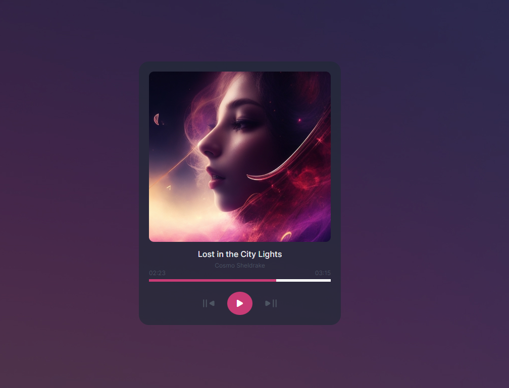

# Music-Player by MaxiDev

Muy buenas, este mi segundo desafió para JavaScript Developer, este consiste en hacer un reproductor de música básico  

COVER 1-> 
COVER 2-> 

-> Ver Pagina Aquí <https://music-player-dev.netlify.app/index.html>
